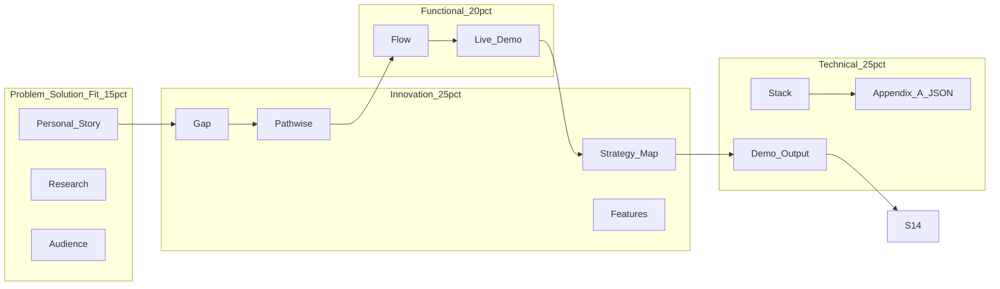

# Pathwise — Final-Round Pitch Deck Plan

**Purpose:** Slide structure and speaker notes for hackathon judging, mapped to the official rubric weights.  
**Audience:** Human judges + repo reviewers (including automated review).  
**Product reference:** [PRD](../architecture/PRD.md) · [Architecture](../architecture/ARCHITECTURE.md)

**Recommended runtime:** 4–5 minutes spoken + 60–90 seconds live demo (or embedded recording on Slide 8).  
**Deck cap:** 14 slides — one job per slide.  
**North-star sentence:** *"I was scattered. Pathwise found my bottleneck, told me what to cut, and gave me the next 7 days."*

---

## Rubric map (portal weights)

| Criterion | Weight | Primary slides |
|-----------|--------|----------------|
| Innovation & Originality | 25% | 1, 4, 5, 8, 9, 13 |
| Technical Execution | 25% | 11 (+ Appendix A B-roll), 12, live demo |
| Functional Completeness | 20% | 7, 8, 12, live demo |
| Problem-Solution Fit | 15% | 2, 3, 6, 12 |
| User Experience & Design | 10% | 8, 9, 12 |
| Demo & Communication | 10% | 1, 7, 8, 12, 14 |



---

## Slide-by-slide structure

### Slide 1 — Hook
**Job:** Make judges lean in  
**Rubric:** Innovation, Demo & Communication

**On-slide (example):**  
*Ambitious students don't lack motivation — they lack strategy. At any moment, dozens of things could be "the priority." Almost no tool tells you which few actually move the needle.*

**Speaker notes:** No product name yet. Pause after the line.

---

### Slide 2 — The problem (personal)
**Job:** Humanize the pain  
**Rubric:** Problem-Solution Fit

**Overview:** Canonical UCalgary second-year CS student — five courses, 12 hr/week job, club, two unfinished projects, networking, research curiosity, empty GitHub, no LeetCode, feels behind ([PRD target user](../architecture/PRD.md)).

**Speaker notes:** End with: *They don't need another task list. They need to know what actually matters.*

---

### Slide 3 — The problem (research-backed)
**Job:** Prove it's not anecdotal  
**Rubric:** Problem-Solution Fit, Innovation

**Three cards max:**
1. Decision fatigue / cognitive load under overload  
2. Choice overload → less follow-through (Iyengar & Lepper)  
3. Specific goals + feedback improve performance (Locke & Latham)

**Speaker notes:** *Students aren't lazy — they're optimizing under too many competing "yeses" without a strategy layer.*

---

### Slide 4 — The gap
**Job:** Show white space  
**Rubric:** Innovation (25%) — category creation

| Execution tools | Strategy questions (unanswered) |
|-----------------|----------------------------------|
| Notion, Todoist, calendars | What is my **one** bottleneck? |
| Task lists | What should I **cut / defer / double down**? |
| Generic AI chat | Does this **opportunity** fit my route? |
| Course planners | What should I do in the **next 7 days**? |

**Speaker notes:** *Productivity assumes you already know what matters. Pathwise builds a model of your situation first.*

---

### Slide 5 — Introducing Pathwise
**Job:** Name + promise  
**Rubric:** Innovation, Demo & Communication

**Tagline:** **You say the what. We tell the how.**  
**Subline:** Strategy dashboard → bottleneck, cut list, 7-day route, opportunity lens.

---

### Slide 6 — Target audience
**Job:** Who it's for  
**Rubric:** Problem-Solution Fit

- **Primary:** Ambitious students with a goal but scattered execution (internship CS anchor).  
- **Secondary:** Students who need structured clarity on where to start.  
- **Not:** Advisor replacement, calendar, degree audit ([PRD](../architecture/PRD.md)).

---

### Slide 7 — How it works (journey)
**Job:** Explain the loop  
**Rubric:** Functional Completeness, UX

1. Onboarding + brain dump → `StudentProfile`  
2. Groq → strict JSON → **Zod** → Supabase  
3. Dashboard: bottleneck, alignment, **Strategy Map**, cut list, 7 days, opportunity check

**Speaker notes:** Stress **end-to-end**, not a feature laundry list.

---

### Slide 8 — Strategy Map (wow / demo handoff)
**Job:** Visual proof of originality  
**Rubric:** Innovation, UX, Technical (Three.js)

Full-bleed screenshot or **live demo** at `/dashboard/demo-cs-student-001`.

**Caption:** *Your strategy as a place you read in 10 seconds — not a list you maintain.*

**Live demo (25s):** bottleneck visible → optional pillar hover/drill → do not narrate every pixel.

---

### Slide 9 — Key features (four decisions)
**Job:** Tie features to insight  
**Rubric:** Innovation, Functional Completeness, UX

| Feature | Question |
|---------|----------|
| Strategy Map | How do pillars relate to my goal? |
| Bottleneck + alignment | What blocks me right now? |
| Cut list | What should I stop pretending is progress? |
| Opportunity check | Should I say yes — and what must I give up? |

**Tone example:** *Your bottleneck is no shipped project. Everything else is secondary until that changes.*

---

### Slide 10 — Research foundation
**Job:** Credibility without bibliography dump  
**Rubric:** Innovation (not "another AI wrapper")

1. Specific goals → structured `StrategyPlan`, not chat fluff  
2. Visual strategy → Strategy Map as primary UI  
3. Fewer commitments → cut list as first-class artifact  
4. Feedback loops → alignment score + 7-day route  

**Keep to ~20 seconds spoken.**

---

### Slide 11 — Technical execution
**Job:** Prove engineering depth  
**Rubric:** Technical Execution (25%)

**On-slide:** Architecture diagram + stack chips (Next.js · TypeScript · Groq · Zod · Supabase · Three.js · Framer Motion).

```text
StudentProfile → POST /api/generate → Groq (strict JSON)
  → Zod validate (+ retry) → Supabase JSONB
  → /dashboard/[planId] → Strategy Map (Three.js, 2D fallback)
  → POST /api/opportunity → strategy-aware verdict
```

**Callouts:** Typed schema, validation retry, custom graph (not React Flow), demo route for zero-fail judging.

**B-roll (Appendix A) — use while narrating Slide 11:**  
Do **not** add a 15th slide. During this slide (or immediately after the diagram), cut to a **screen recording or IDE screenshot** of real `StrategyPlan` JSON (see [Appendix A](#appendix-a-strategyplan-json-b-roll) below). Judges see messy brain dump in → **typed, opinionated JSON** out. Say: *"Every field is validated before it hits the dashboard — enums, min pillars, cut list, next 7 days."*

**Speaker notes:** Honest line: demo dashboard is seeded for reliability; generate + opportunity paths are wired in repo (`lib/validate.ts`, `app/api/generate`, `app/api/opportunity`).

---

### Slide 12 — Demo scenario (output quality)
**Job:** Prove AI isn't generic  
**Rubric:** Functional Completeness, Problem-Solution Fit, Technical

| Field | Demo output |
|-------|-------------|
| Destination | Software Engineering Internship |
| Bottleneck | No shipped project — GitHub empty |
| Alignment | 64% |
| Cut | Another general club |
| Defer | Research outreach |
| Double down | One shipped portfolio project |
| Opportunity (robotics) | 78%, Say Yes With Conditions + caps/cuts |

**On-slide:** Brain-dump excerpt vs dashboard screenshot.

---

### Slide 13 — Vision (brief)
**Job:** Ambition without scope creep  
**Rubric:** Innovation, Demo & Communication

- Personal strategy OS (students first)  
- Opportunity check before every "yes"  
- Strategy Map as democratized scorecard view  

---

### Slide 14 — Close
**Job:** What judges remember  
**Rubric:** Demo & Communication

- **Built:** Full loop — onboarding, generation, dashboard, map, cuts, 7 days, opportunity  
- **Different:** Strategy layer + visual map + opinionated cuts  
- **Tagline:** **You say the what. We tell the how.**

---

## Live demo script (60–90s)

1. `/` — 5s  
2. `/dashboard/demo-cs-student-001` — 25s (header, map, one cut)  
3. Next 7 days — one action — 10s  
4. Opportunity: *"Should I join the robotics club?"* — 20s  
5. North-star sentence — 5s  

**If AI fails:** Demo route + deterministic opportunity fallback still show full UX.

---

## Appendix A: StrategyPlan JSON (B-roll)

**Use on:** Slide 11 (Technical Execution), as picture-in-picture, quick cut, or second monitor — not a standalone judge-facing slide unless Q&A.

**What to capture:** Screenshot or 10s screen recording of one of:
- `lib/fixture.ts` → `fixturePlan` in the repo (judges can verify it matches the app), or  
- Supabase row / API response from `POST /api/generate`, or  
- Browser devtools Network tab → generate response body.

**What to say over the B-roll (15–20s):**
- "Groq returns text; we **parse and validate** with Zod before save."  
- "Enums force opinionated cut types — Cut, Defer, Keep, Double Down."  
- "Pillars nest actions — that's what feeds the Strategy Map."  
- "If validation fails, we **retry once** with a correction prompt."

**Trimmed example** (matches demo fixture — safe to show on slide recording):

```json
{
  "destination": "Software Engineering Internship",
  "currentStage": "Skill Signal",
  "mainBottleneck": "No shipped project — GitHub is empty",
  "routeStatus": "Scattered",
  "alignmentScore": 64,
  "strategicPillars": [
    {
      "name": "Skill Signal",
      "status": "Weak",
      "reason": "GitHub is empty and no project is shipped.",
      "actions": [
        {
          "name": "Portfolio Project",
          "status": "At Risk",
          "recommendation": "Pick one project and ship it."
        }
      ]
    }
  ],
  "cutList": [
    {
      "activity": "Joining another general club",
      "recommendation": "Cut",
      "reason": "Adds meetings without fixing the internship bottleneck."
    }
  ],
  "nextSevenDays": [
    {
      "title": "Push current progress to GitHub today",
      "priority": "High"
    }
  ]
}
```

**Canonical schema source in repo:** [`lib/validate.ts`](../lib/validate.ts) → `StrategyPlanSchema` (Zod). Link judges to this file when they review the repository.

**Rubric line:** This B-roll directly supports **Technical Execution** (validation, schema, integration) and **Functional Completeness** (structured output powers the whole dashboard).

---

## Appendix B — Team / timeline (optional)

Hackathon roles, who owned graph vs API vs UX, hours 0–24. Only if judges ask or event requires team slide.

---

## Appendix C — Non-goals (optional)

From [PRD non-goals](../architecture/PRD.md): no degree audit, no calendar sync, no social, single goal track for MVP. Use in Q&A if scope challenged.

---

## Presentation discipline

1. One job per slide — merge if you can't name the job in five words.  
2. Never cut Slides **4, 8, 11, 12**; optional cut is Slide 10 (research).  
3. **Slide 11 = diagram + Appendix A B-roll** — strongest technical moment.  
4. Rehearse 60-second judge comprehension before polish.  
5. Repo path for reviewers: `docs/presentation/PITCH_DECK_PLAN.md` (this file).

---

## Build checklist

- [ ] Build 14 slides from sections above  
- [ ] Record Appendix A B-roll (fixture JSON or live generate response)  
- [ ] Capture Strategy Map + dashboard for Slides 8 and 12  
- [ ] Rehearse live demo path  
- [ ] Verify research citations on Slides 3 and 10
